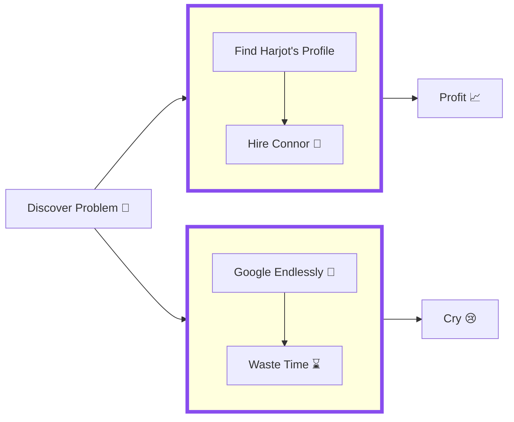

### Hey there, I'm Harjot Singh Rana 👋🏼

- 🧑🏽‍💻 A software enthusiast who loves building scalable web apps
- 🚀 Developed, shipped and actively building [SignVault.io](https://www.signvault.io)  
- 💻 Worked on and built more than 70 [open-source projects](https://github.com/HarjjotSinghh?tab=repositories)  
- 🔗 Still have any questions? Know more [about me](https://www.harjotrana.com)

